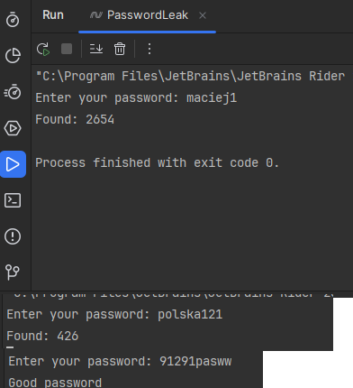

# PasswordLeak

## Overview

This C# console application checks if a given password has been exposed in data breaches using the Pwned Passwords API.

## Usage

1. **Run the Application:**
   - Build and run the application in a C# development environment (e.g., Visual Studio, Visual Studio Code, Rider).
   - Install important NuGet Package

2. **Enter Password:**

3. **Check for Compromise:**
   - The application queries the Pwned Passwords API with the hashed password and checks if it has been compromised.

4. **View Results:**
   - If the password is found in the Pwned Passwords database, the application displays the number of occurrences. Otherwise, it declares the password as "Good."

## Note

- **Pwned Passwords API:**

